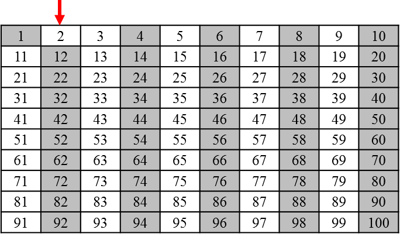

============================================
에라토스테네스의 체 erthosthenes sieve
============================================

.. tip::

    - 그리스의 수학자·천문학자·지리학자이다. 소수(素數)를 발견하는 방법으로서 에라토스테네스의 체(코스키콘)를 고안하고, 해시계로 지구 둘레의 길이를 처음으로 계산하였다. 지리상의 위치를 위도·경도로 표시한 것은 그가 처음인 것으로 알려져 있다.
    - 출처> `[네이버 지식백과] <https://terms.naver.com/entry.nhn?docId=1125082&cid=40942&categoryId=40465>`

양의 정수는 3가지로 구분한다.

- 1 : 특별한 수로 취급한다.
- 소수 : 1과 자신만을 약수로 가지는 수.
- 합성수 : 1과 소수를 제외한 나머지들.

1 에서 100 사이 소수 찾기
--------------------------------------------------

1. 먼저 **1** 은 소수가 아니므로 제외한다.

2. **2** 부터 시작해서 소수를 찾으면서 합성수를 제거해 나간다. 2의 배수들은 모두 2를 약수로 가지므로 제외한다.

3. 이제 다음으로 제외되지 않은 가장 작은 수 **3** 을 선택하고, 3의 배수들을 제외한다.

4. **5** 를 선택하고, 5의 배수들을 제외한다.

5. **7을 선택하고, 7의 배수들을 제외한다.

이런식으로 반복하면 1 에서 100 사이의 모든 소수를 찾을 수 있다.
실제로 해보면 10 보다 큰 소수들에 대해서 배수를 찾을 필요가 없다는 사실을 알 수 있다.
10 의 제곱이 100 이므로 사실 10 까지만 하면 된다. 왜 그럴까?

.. tip:

.. note::

    1 에서 100 사이의 소수들:

    2, 3, 5, 7, 11, 13, 17, 19, 23, 29, 31, 37, 41, 43, 47, 53, 59, 61, 67, 71, 73, 79, 83, 89, 97
